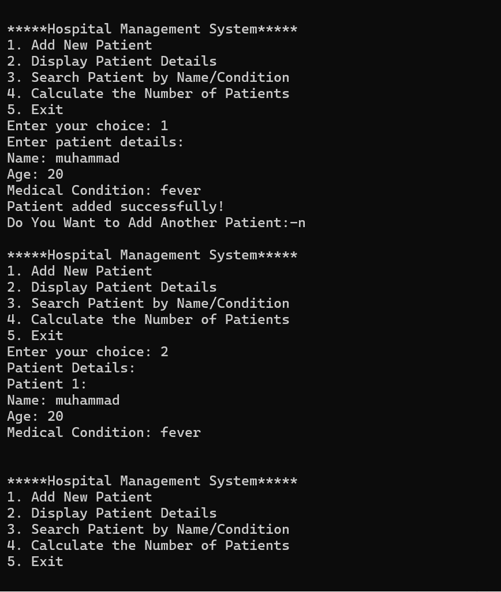

# 🏥 Hospital Management System (C++)

## 📌 Overview
A basic console-based Hospital Management System developed using C++ in my 1st semester as part of the "Programming Fundamentals" course. It allows staff to add new patients, search patient records, and view all registered patients.

## ✨ Features
- Add patient records
- Search by name or condition
- Display all patients
- Count total number of patients

## 🛠 Technologies
- Language: C++
- Paradigm: Procedural Programming

## 🚀 How to Run
Copy the code , paste and compile it using your favourite IDE (Dev C++ , VSCode etc.)

## 📸 Screenshot

Here is a screenshot showing the Hospital Management System running:

